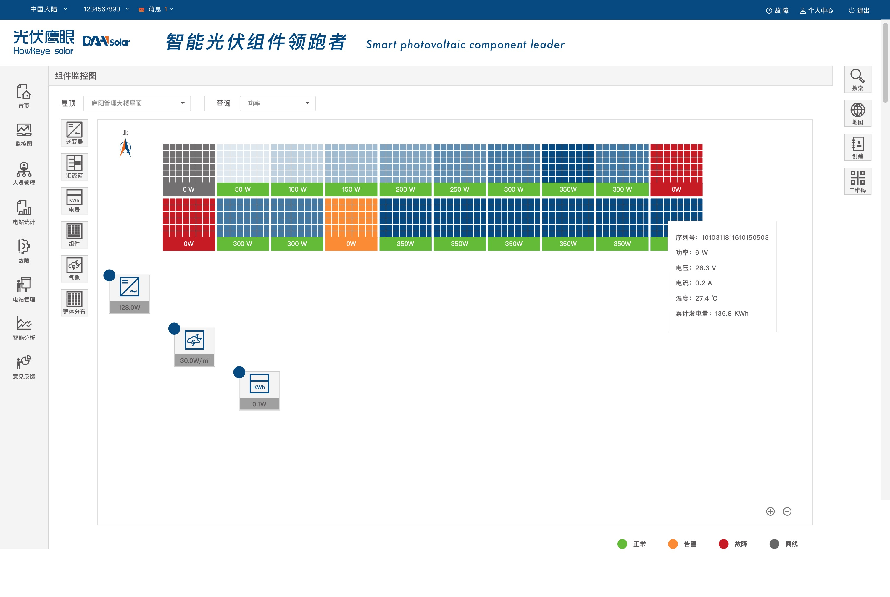

# 利用chrome来调试less文件

## Working With LESS and the Chrome DevTools

https://code.tutsplus.com/tutorials/working-with-less-and-the-chrome-devtools--net-36636

DevTools already has write access to your development folder (through Workspaces). Command/Control-S your changes in the Sources panel to have DevTools overwrite the source LESS file with your new change, Grunt compiles a new CSS file which DevTools pulls in and applies to the page.

## 用到的插件

* vscode --- Easy LESS
* vscode --- browsersync

## 剩下迫切需要解决的问题

* 图床的问题 最好是能利用github作为图床，因为比较靠谱

https://www.bilibili.com/video/av9698681/ 利用github 搭建图床，外加绑定地址；

> 其实问题被自己想的太复杂了，自己利用图床的目的就是，写markdown文件，而markdown不但可以引用http开头的绝对路径图片，其也可以引用相对路径的本地图片，类似于html文件一样，如同书写html一样，将图片单独放到一个文件夹，而后在md文件中引用，而后将整个workspace提交到git上面就可以了，文件与md文件同处一个环境，且无论是在gtihub线上 还是在本地 都可以正常的预览；

* 无密码提交git的问题，已经反复的出现多次了；